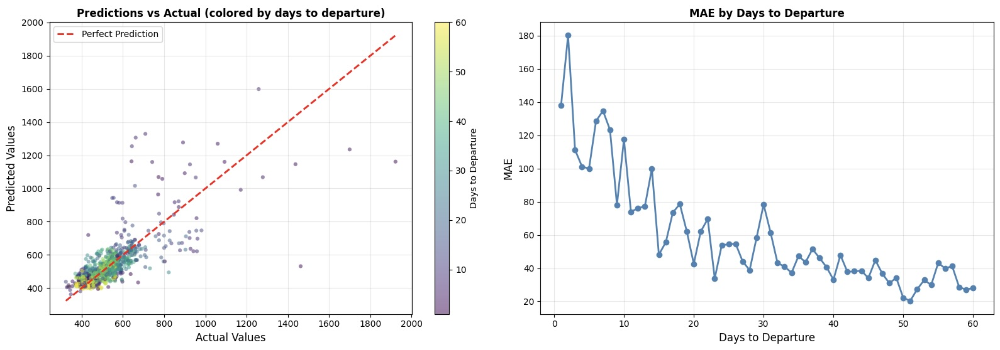

# Ideal Booking Day Estimator for Flights

Airline ticket prices often seem unpredictable. Existing platforms such as Google Flights and
Skyscanner do not give recommendation on how the prices **will
change concerning different booking dates** for the same flight.

Given a user input of a specific date of flight, our goal is to predict the optimal day to purchase the ticket (that is, the day on
which the fare is lowest). Our work is distinct from most of the prior airline fare prediction research, because it optimizes **_when to book a given flight_**, rather than **_which  flight to choose_**.

**→ [Full project report (PDF)](https://drive.google.com/file/d/1etEO4iy_NwO04r_AjLC9vBM8Gl8hIVIn/view)**

## Summary

Exact numbers, code snippets, and analysis are in the **[project report](https://drive.google.com/file/d/1etEO4iy_NwO04r_AjLC9vBM8Gl8hIVIn/view)**. High-level overview and takeways:

- **Data Source:** Expedia Flight Prices dataset (Kaggle), containing North American flights between April 2022 and October 2022.
- **Model:** XGBoost (Gradient Boosted Trees) and Ridge Regression.
- **Preprocessing:** Interpolation of missing values, feature engineering (calendar-based features), and normalization.
- **Evaluation:** Mean Absolute Error (MAE).
- **Results:** XGBoost outperforms Ridge Regression in predicting fare evolution. The best model achieved a test **MAE of 52 dollars**.

- **Left plot:** Scatter plot comparing predicted vs actual values, colored by days to departure
- **Right plot:** Mean Absolute Error (MAE) across different days to departure

As demonstrated, the model performs well in predicting booking prices that are weeks away from the day of departure (~25 dollar MAE) but underperforms when the booking date is just a few days away (~180 dollar MAE). This is likely due to the high price volatility typical of last-day bookings, which is much harder for the model to learn.

